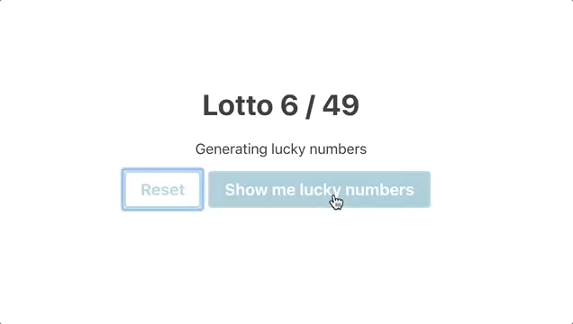

# Lotto numbers

**Exercise to practice REACT and SCSS.**

On clicking on `Show me lucky numbers` 6 numbers between 1 and 49 should be generated and displayed. All of the 6 numbers are unique.
In addition one number between 1 and 10 is generated and displayed. Every time you click the button a new set of lucky numbers are generated and displayed.

On clicking on the `Reset` button all numbers are hidden.
